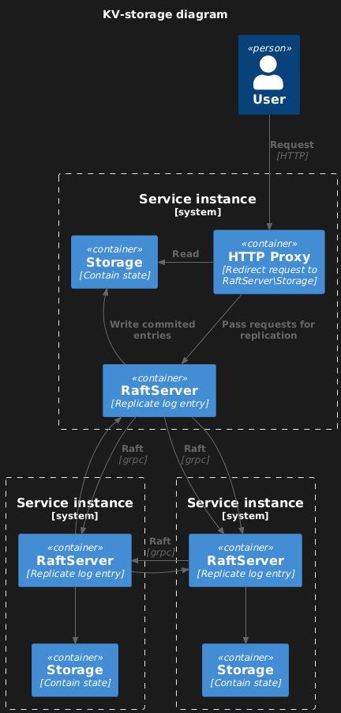

# Distributed fault-tolerant kv-storage

An assignment for the HSE course on TFTDS in which we need to make a distributed fault-tolerant key-value store using the Raft protocol

## Architecture



## HTTP API

`GET /keys/{key}`

Fetch the value associated with a specific key.

* Path Parameters:
    * `key` (string): The key to retrieve.

* Responses:
    * `200 OK`: Value retrieved successfully.
    ```json
    {
        "key": "exampleKey",
        "value": "exampleValue"
    }
    ```
    * `404 Not Found`: The key does not exist.
    * `303 See Other`: Cannot read from master.


`POST /keys`

Create a new key-value pair in the store.

* Request Body:
    ```json
    {
        "key": "exampleKey",
        "value": "exampleValue"
    }
    ```
* Responses:
    * `201 Created`: Key created successfully.
    * `409 Conflict`: Key already exists.


`PUT /keys/{key}`

Update the value of an existing key.

* Path Parameters:
    * `key` (string): The key to update.

* Request Body:
    ```json
    {
        "value": "newValue"
    }
    ```
* Responses:
    * `200 OK`: Key updated successfully.
    * `404 Not Found`: The key does not exist.


`DELETE /keys/{key}`

Remove a key and its associated value from the store.

* Path Parameters:
    * `key` (string): The key to delete.

* Responses:
    * `200 OK`: Key deleted successfully.
    * `404 Not Found`: The key does not exist.


`POST /cas`

Update the value of a key only if the current value matches the expected value.

* Request Body:
```json
    {
    "key": "exampleKey",
    "old_value": "currentValue",
    "new_value": "newValue"
    }
```
* Responses:
    * `200 OK`: Value successfully swapped.
    * `409 Conflict`: CAS operation failed due to a value mismatch.
    * `404 Not Found`: The key does not exist.

